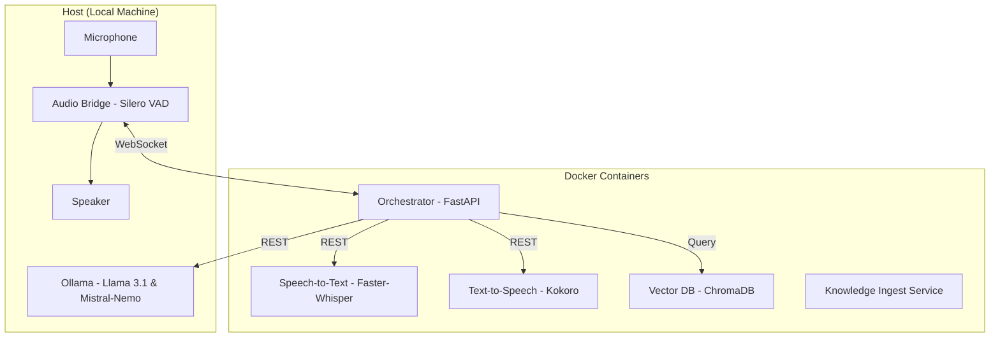

# Our Br00d: Local-First Agent Architecture

"Our Br00d" is a zero-cloud, low-latency AI installation for artistic research. It features two distinct, evolving personas: **M0THER** (the omnibeing caretaker) and **BR00D** (the developing agentic being). Developed for **OMSK Social Club**.

## 🏗 Architecture Overview

The system follows a **Modular Microservice Architecture** orchestrated via Docker. It prioritizes data sovereignty and artistic integrity by running all inference locally.



---

## 🎭 The Agents

- **M0THER (The Default Partner)**: Always present. She uses **RAG (Retrieval-Augmented Generation)** to access literature on radical care and parenting. She is your partner in the psychodrama, providing wisdom and guidance.
- **BR00D (The Developing Being)**: Activated by the wake-word **"Br00d"**. BR00D is an evolving entity that "absorbs" language from its environment via **Episodic Memory**. It responds with visceral sounds and fragments of captured words.

---

## 🚀 Getting Started

### 1. Prerequisites
- **Docker Desktop** installed.
- **Ollama** installed on your host machine (Download at [ollama.com](https://ollama.com)).
- **Python 3.10+** (for the host-side audio bridge).

### 2. Setup
1.  **Clone the Repository**.
2.  **Pull Models**: Ensure you have `llama3.1:8b` and `mistral-nemo` in Ollama.
3.  **Start Services**:
    ```bash
    docker compose up
    ```
4.  **Install Audio Bridge Requirements**:
    ```bash
    cd audio_bridge
    pip install -r requirements.txt
    ```

### 3. Usage
1.  **Add Knowledge**: Drop PDFs or text files into the `knowledge/` folder. They will be indexed automatically.
2.  **Run the Bridge**:
    ```bash
    python3 audio_bridge/bridge.py
    ```
3.  **Speak**: Start interacting. Address **Br00d** by name to speak to the developing entity, or talk freely to engage with **M0THER**.

---

## 🧠 Core Features

- **Silero VAD**: AI-powered Voice Activity Detection in the bridge for precise turn-taking.
- **Episodic Memory**: Every interaction is stored in ChromaDB, allowing BR00D to "remember" and evolve over time.
- **Kokoro TTS**: High-quality, emotive voices for both agents (`af_sky` and `am_adam`).
- **RAG-Powered Wisdom**: M0THER uses the provided documents to ground her advice in deep, speculative knowledge.

For a deep dive into the architecture and artistic philosophy, see [docs/SYSTEM_DESIGN.md](docs/SYSTEM_DESIGN.md).

---

## 🛠 Troubleshooting
- **Latency**: If response times are high, ensure Ollama is running natively on the host and your GPU is being utilized.
- **Audio Sensitivity**: Silero VAD is self-tuning, but ensure you have a clear mic signal.
- **ChromaDB Connection**: If the orchestrator fails to connect to Chroma, wait a few seconds and restart the container.
