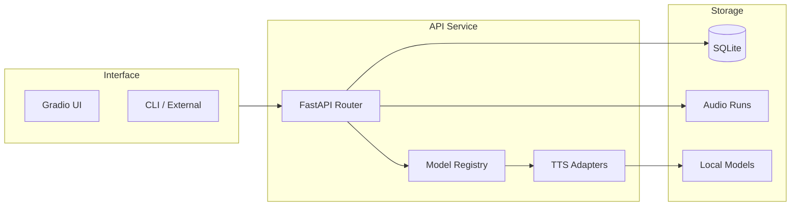

# TTS Arena

Standalone TTS Benchmark and Evaluation Tool.

This project provides:
- FastAPI backend for synthesis and evaluation APIs
- Gradio UI for local benchmarking
- SQLite persistence for generation runs and 1-5 ratings
- Adapter-based model registry so new models can be added with one class

## Architecture



## Quick Start (Standalone)

Run these commands from within the `tts_arena` directory.

### 1) Install dependencies

We use `uv` for fast dependency management.

```bash
# Install uv if you haven't:
# curl -LsSf https://astral.sh/uv/install.sh | sh

uv sync
```

### 2) Run API (Terminal A)

```bash
uv run python -m tts_benchmark.main --mode api
```
API base URL: http://127.0.0.1:8000

### 3) Run UI (Terminal B)

```bash
uv run python -m tts_benchmark.main --mode ui
```
UI URL: http://127.0.0.1:7860

### 4) Run Tests

```bash
uv run pytest
```

## Project Structure

```text
.
├── pyproject.toml
├── src/tts_benchmark/      # Source code
├── tests/                  # Test suite
└── tts_arena/              # Local data (DB, Models, Outputs)
```

## API Surface

Base URL: http://127.0.0.1:8000

Endpoints:
- GET /health
- GET /v1/models
- POST /v1/synthesize
- POST /v1/evaluations
- GET /v1/evaluations/{evaluation_id}

### List models

```bash
curl http://127.0.0.1:8000/v1/models
```

### Synthesize audio

```bash
curl -X POST http://127.0.0.1:8000/v1/synthesize \
  -H "Content-Type: application/json" \
  -d '{
    "text": "Hello from pipeline",
    "model_key": "kokoro-82m",
    "voice_key": "af_bella",
    "speed": 1.0,
    "settings": {"gain": 0.2}
  }'
```

The response includes:
- run_id
- audio_path
- latency_ms
- metadata.requested_settings
- metadata.applied_settings
- metadata.normalized_voice_key

### Submit evaluation

```bash
curl -X POST http://127.0.0.1:8000/v1/evaluations \
  -H "Content-Type: application/json" \
  -d '{
    "run_id": "<run_id>",
    "latency_rating": 4,
    "naturalness_rating": 4,
    "tone_quality_rating": 5,
    "stability_rating": 4,
    "reviewer_note": "Good baseline"
  }'
```

### Retrieve evaluation with full run context

```bash
curl http://127.0.0.1:8000/v1/evaluations/<evaluation_id>
```

## Run Independently

Use this project as a fully local tool without any dependency on the rest of the repository:

1. Start API on port 8000
2. Start UI on port 7860
3. Generate, listen, score, and retrieve records

All outputs remain local:
- DB: tts_arena/data/tts_benchmark.sqlite3
- Audio: tts_arena/outputs/runs/

## Integrate Into the Whole Pipeline

Other services in the repo can call this API as an internal dependency.

### Integration pattern

1. Ensure the API is reachable at a stable URL
2. Set a shared variable such as TTS_BENCHMARK_API_URL
3. Call /v1/models for capability discovery
4. Call /v1/synthesize for generation
5. Call /v1/evaluations to persist benchmark feedback

### Example Python client usage

```python
import requests

base = "http://127.0.0.1:8000"

models = requests.get(f"{base}/v1/models", timeout=30).json()["models"]
model_key = models[0]["model_key"]

synth = requests.post(
    f"{base}/v1/synthesize",
    json={
        "text": "Pipeline integration sample",
        "model_key": model_key,
        "speed": 1.0,
        "settings": {},
    },
    timeout=60,
).json()

requests.post(
    f"{base}/v1/evaluations",
    json={
        "run_id": synth["run_id"],
        "latency_rating": 4,
        "naturalness_rating": 4,
        "tone_quality_rating": 4,
        "stability_rating": 4,
    },
    timeout=30,
).raise_for_status()
```

### Docker Compose wiring hint

If you want to connect this service to an existing compose stack, use an internal service hostname and configure clients through environment variables.

Example concept:

```yaml
services:
  tts-benchmark:
    build: ./tts_arena
    ports:
      - "8000:8000"
      - "7860:7860"

  orchestrator:
    environment:
      TTS_BENCHMARK_API_URL: http://tts-benchmark:8000
```

## Add a New Model in One Class

The extension contract is adapter-based.

1. Create one new adapter class in src/tts_benchmark/inference/adapters/
2. Implement methods from BaseTTSAdapter
3. Register the adapter in adapters initialization
4. Restart API/UI

No UI code changes are required if the adapter contract is respected.

## Troubleshooting

- Port conflict on 8000 or 7860: run with different ports
- Broken DB state during experiments: remove tts_arena/data/tts_benchmark.sqlite3 and restart API
- Old audio artifacts: clear tts_arena/outputs/runs/
- Settings validation errors: ensure settings payload is a JSON object

## References

- Contract: specs/001-tts-benchmark-eval-tool/contracts/tts-benchmark.openapi.yaml
- Plan: specs/001-tts-benchmark-eval-tool/plan.md
- Feature tasks: specs/001-tts-benchmark-eval-tool/tasks.md
