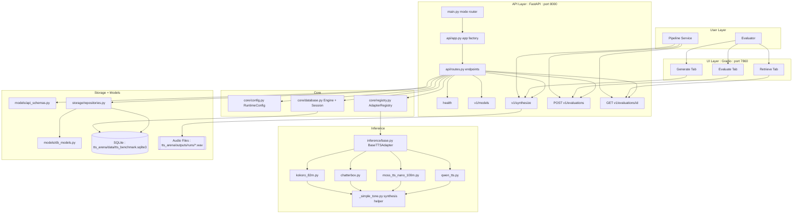

# TTS Arena

Standalone TTS Benchmark and Evaluation Tool inside this repository.

This project provides:
- FastAPI backend for synthesis and evaluation APIs
- Gradio UI for local benchmarking
- SQLite persistence for generation runs and 1-5 ratings
- Adapter-based model registry so new models can be added with one class

## Status

Current adapters are functional local stubs that generate deterministic tone audio for testability.
The architecture is ready for full Hugging Face model inference, but real model loading logic must be implemented inside adapter classes.

## Fresh Clone Quick Start

### 1) Clone and enter the repository

```bash
git clone <your-repo-url>
cd OurBr00d
```

### 2) Install uv (if needed)

macOS/Linux:

```bash
curl -LsSf https://astral.sh/uv/install.sh | sh
```

Then restart your shell, or ensure uv is on PATH.

### 3) Install project dependencies

```bash
cd tts_arena
uv sync
```

### 4) Run API (Terminal A)

```bash
uv run python -m tts_benchmark.main --mode api --host 127.0.0.1 --port 8000
```

API base URL: http://127.0.0.1:8000

### 5) Run UI (Terminal B)

```bash
cd tts_arena
uv run python -m tts_benchmark.main --mode ui --host 127.0.0.1 --port 7860 --api-base http://127.0.0.1:8000
```

UI URL: http://127.0.0.1:7860

### 6) Run tests

From repository root:

```bash
python3 -m pytest tts_arena/tests/tts_benchmark -q
```

## Architecture



## Project Structure

```text
tts_arena/
├── pyproject.toml
├── src/tts_benchmark/
│   ├── api/
│   ├── core/
│   ├── inference/
│   │   └── adapters/
│   ├── models/
│   ├── storage/
│   ├── ui/
│   └── main.py
└── tests/tts_benchmark/
```

## API Surface

Base URL: http://127.0.0.1:8000

Endpoints:
- GET /health
- GET /v1/models
- POST /v1/synthesize
- POST /v1/evaluations
- GET /v1/evaluations/{evaluation_id}

### List models

```bash
curl http://127.0.0.1:8000/v1/models
```

### Synthesize audio

```bash
curl -X POST http://127.0.0.1:8000/v1/synthesize \
  -H "Content-Type: application/json" \
  -d '{
    "text": "Hello from pipeline",
    "model_key": "kokoro-82m",
    "voice_key": "af_bella",
    "speed": 1.0,
    "settings": {"gain": 0.2}
  }'
```

The response includes:
- run_id
- audio_path
- latency_ms
- metadata.requested_settings
- metadata.applied_settings
- metadata.normalized_voice_key

### Submit evaluation

```bash
curl -X POST http://127.0.0.1:8000/v1/evaluations \
  -H "Content-Type: application/json" \
  -d '{
    "run_id": "<run_id>",
    "latency_rating": 4,
    "naturalness_rating": 4,
    "tone_quality_rating": 5,
    "stability_rating": 4,
    "reviewer_note": "Good baseline"
  }'
```

### Retrieve evaluation with full run context

```bash
curl http://127.0.0.1:8000/v1/evaluations/<evaluation_id>
```

## Run Independently

Use this project as a fully local tool without any dependency on the rest of the repository:

1. Start API on port 8000
2. Start UI on port 7860
3. Generate, listen, score, and retrieve records

All outputs remain local:
- DB: tts_arena/data/tts_benchmark.sqlite3
- Audio: tts_arena/outputs/runs/

## Integrate Into the Whole Pipeline

Other services in the repo can call this API as an internal dependency.

### Integration pattern

1. Ensure the API is reachable at a stable URL
2. Set a shared variable such as TTS_BENCHMARK_API_URL
3. Call /v1/models for capability discovery
4. Call /v1/synthesize for generation
5. Call /v1/evaluations to persist benchmark feedback

### Example Python client usage

```python
import requests

base = "http://127.0.0.1:8000"

models = requests.get(f"{base}/v1/models", timeout=30).json()["models"]
model_key = models[0]["model_key"]

synth = requests.post(
    f"{base}/v1/synthesize",
    json={
        "text": "Pipeline integration sample",
        "model_key": model_key,
        "speed": 1.0,
        "settings": {},
    },
    timeout=60,
).json()

requests.post(
    f"{base}/v1/evaluations",
    json={
        "run_id": synth["run_id"],
        "latency_rating": 4,
        "naturalness_rating": 4,
        "tone_quality_rating": 4,
        "stability_rating": 4,
    },
    timeout=30,
).raise_for_status()
```

### Docker Compose wiring hint

If you want to connect this service to an existing compose stack, use an internal service hostname and configure clients through environment variables.

Example concept:

```yaml
services:
  tts-benchmark:
    build: ./tts_arena
    ports:
      - "8000:8000"
      - "7860:7860"

  orchestrator:
    environment:
      TTS_BENCHMARK_API_URL: http://tts-benchmark:8000
```

## Add a New Model in One Class

The extension contract is adapter-based.

1. Create one new adapter class in src/tts_benchmark/inference/adapters/
2. Implement methods from BaseTTSAdapter
3. Register the adapter in adapters initialization
4. Restart API/UI

No UI code changes are required if the adapter contract is respected.

## Troubleshooting

- Port conflict on 8000 or 7860: run with different ports
- Broken DB state during experiments: remove tts_arena/data/tts_benchmark.sqlite3 and restart API
- Old audio artifacts: clear tts_arena/outputs/runs/
- Settings validation errors: ensure settings payload is a JSON object

## References

- Contract: specs/001-tts-benchmark-eval-tool/contracts/tts-benchmark.openapi.yaml
- Plan: specs/001-tts-benchmark-eval-tool/plan.md
- Feature tasks: specs/001-tts-benchmark-eval-tool/tasks.md
